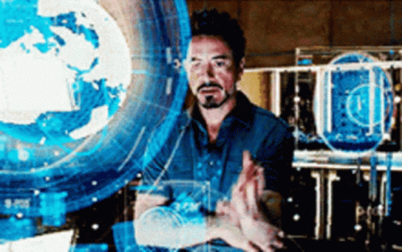

# HoloTouch

> we made jarvis, yo

theme: _navigation_

team HAASHtag's (Hendry, Ariana, Arthur, Song Han)'s submission for BigRedHacks 2026.

> navigating HCI, reimagined.

# problem

we have all seen attempts at making spatial control for computers ([handy](https://github.com/Vin124/handy), [mitsu](https://devpost.com/software/mitsu-hand-and-voice-gesture-control-for-the-desktop), and [gesturecontrol](https://github.com/Mizuna737/gesturecontrol)). however, they **all suck**.

why do they suck?

- literally just mapping your hand to cursor position
  - boring! no one wants a bastardization of spatial HCI by forcing your hand to become a mouse cursor.
- unintuitive gestures w/ low gesture count
- no usage of 3D space and other non-manual controls

all previous solutions are just an attempt to stuff spatial HCI **on top** of an outdated keyboard-mouse interaction framework.

# design goals

HoloWM is designed to be...

- **intuitive** with easy gestures for human hands
- **extensible** with custom gesture creation and fine-tuning
- **3D space-first** by using all the space around the user and using facial features to locate gestures
- **quick** and **responsive,** making it an **actually viable replacement** for keyboard-mouse control

HoloWM is the **closest** you will get to tony stark tossing windows around.

# technical details

# applications + future use
